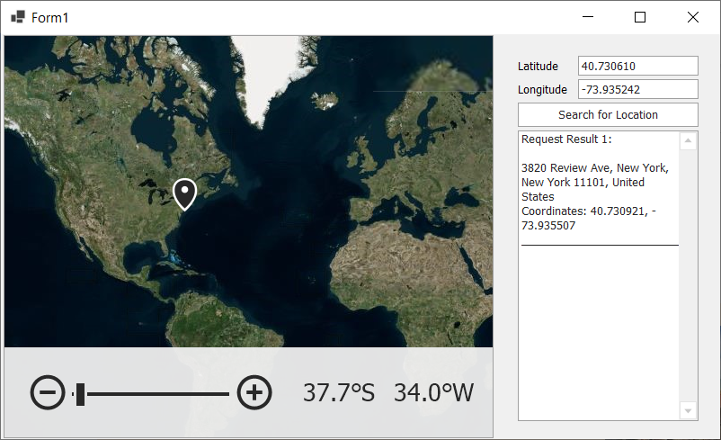

<!-- default badges list -->

<!-- default badges end -->

## WinForms Maps - Obtain Information about a Geographical Point Using the Microsoft Azure Maps Geocode Service

This example obtains information about a geographical point using Microsoft’s Azure Geocode service. 

> **NOTE:**
> To incorporate this solution within your DevExpress-powered app, you need an Azure Maps service [key](https://learn.microsoft.com/en-us/azure/azure-maps/quick-demo-map-app#get-the-subscription-key-for-your-account). Replace the `AzureKey` property value with your subscription key to connect to Azure Maps.

## Implementation Details 

`TextEdit` elements specify a geographical point (`GeoPoint.Longitude` and `GeoPoint.Latitude`). The “Search for Location” button initiates the geocode request. It obtains point information and passes it to the [RequestLocationInformation](https://docs.devexpress.com/WindowsForms/DevExpress.XtraMap.AzureGeocodeDataProvider.RequestLocationInformation.overloads?v=24.2) method. 

Results contain an address (`LocationInformation.Address`) and exact coordinates (`LocationInformation.Location`). Results are displayed within the DevExpress `MemoEdit` UI element. 

Output:

## Files to Look At

* [Form1.cs](./CS/AzureGeocoding//Form1.cs) (VB: [Form1.vb](./VB/AzureGeocoding/Form1.vb))

## Documentation

* [Geocode](https://docs.devexpress.com/WindowsForms/16712/controls-and-libraries/map-control/gis-data/geocode)

## More Examples 

- [WinForms Maps - Create a Custom Search Panel Using the Microsoft Azure Maps Search Service](https://github.com/DevExpress-Examples/map-for-winforms-azure-search)
- [WinForms Maps - Use the Azure Maps Route Service to Calculate Routes between GeoPoints on a Map Surface](https://github.com/DevExpress-Examples/map-for-winforms-azure-routing)

## Does this example address your development requirements/objectives?

 

(you will be redirected to DevExpress.com to submit your response)
<!-- feedback end -->
